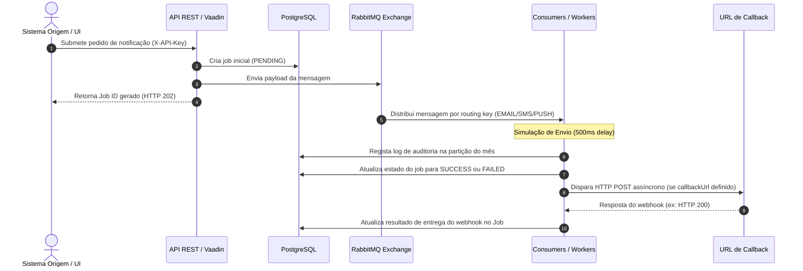

# Unilabs Notification Center

O **Notification Center** é o motor unificado e agnóstico de comunicações da empresa. Centraliza o processamento e envio de notificações em múltiplos canais de forma assíncrona, escalável e resiliente, com auditoria completa das entregas e suporte a webhooks de retorno.

---

## 🗺️ Fluxo de Arquitetura



---

## 🛠️ Tecnologias Utilizadas

| Componente | Tecnologia |
|------------|-----------|
| Backend | Java 21 + Spring Boot 4.0.6 |
| Portal | Vaadin 25.1.6 |
| Mensajaria | RabbitMQ 3 (Direct Exchange) |
| Base de Dados | PostgreSQL 15 (particionamento mensal) |
| Build | Maven Wrapper |

---

## 🚀 Como Iniciar Localmente

### Pré-requisitos
- Docker Desktop a correr
- Java 21 (Eclipse Adoptium JDK 21)
- Maven extraído em `C:\maven\apache-maven-3.9.16`

### Arranque automático (recomendado)
Faz duplo clique em `run-all.cmd` na raiz do projeto. O script:
1. Sobe os containers Docker (PostgreSQL + RabbitMQ)
2. Instala o módulo shared
3. Arranca o backend numa janela separada
4. Arranca o portal noutra janela

### Arranque manual

**Passo 1 — Definir variáveis de ambiente (em cada janela CMD):**
```cmd
set JAVA_HOME=C:\Program Files\Eclipse Adoptium\jdk-21.0.11.10-hotspot
set PATH=%JAVA_HOME%\bin;C:\maven\apache-maven-3.9.16\bin;%PATH%
cd C:\caminho\para\projeto-notificacoes
```

**Passo 2 — Subir infraestrutura:**
```cmd
docker compose up -d
```

**Passo 3 — Instalar o módulo shared:**
```cmd
mvn -pl shared install
```

**Passo 4 — Arrancar o backend (porta 8080):**
```cmd
mvn -pl backend spring-boot:run
```

**Passo 5 — Arrancar o portal (porta 8082) — noutra janela:**
```cmd
mvn -pl portal compile spring-boot:run
```

### URLs disponíveis

| Serviço | URL |
|---------|-----|
| Portal Vaadin | http://localhost:8082 |
| Swagger UI | http://localhost:8080/swagger-ui.html |
| OpenAPI JSON | http://localhost:8080/v3/api-docs |
| Health Check | http://localhost:8080/actuator/health |
| RabbitMQ UI | http://localhost:15672 (guest/guest) |

---

## 🔐 Segurança — API Key

Todos os endpoints `/api/**` requerem autenticação por API Key via header HTTP:

```
X-API-Key: unilabs-secret-key-2026
```

Sem este header, a API retorna `HTTP 401 Unauthorized`.

**Endpoints públicos** (não requerem API Key):
- `GET /actuator/health`
- `GET /swagger-ui/**`
- `GET /v3/api-docs/**`

**Alterar a chave** — edita `backend/src/main/resources/application.properties`:
```properties
api.security.key=a-tua-chave-secreta
```

---

## 📖 Referência da API REST

### Autenticação
Todos os exemplos abaixo incluem o header obrigatório `X-API-Key`.

### 1. Criar Notificação
```
POST /api/v1/notifications
X-API-Key: unilabs-secret-key-2026
Content-Type: application/json
```

**E-mail:**
```json
{
  "clientId": "portal-do-paciente",
  "channelType": "EMAIL",
  "recipient": "paciente@exemplo.com",
  "templateName": "template_resultados_exame",
  "parameters": {
    "nome_paciente": "Maria Silva",
    "data_exame": "2026-06-16"
  },
  "callbackUrl": "https://meu-sistema.com/webhooks/notificacoes"
}
```

**SMS:**
```json
{
  "clientId": "portal-do-paciente",
  "channelType": "SMS",
  "recipient": "+351912345678",
  "templateName": "template_lembrete_consulta",
  "parameters": {
    "data_consulta": "2026-06-20",
    "hora_consulta": "10:30"
  }
}
```

**Push:**
```json
{
  "clientId": "app-mobile",
  "channelType": "PUSH",
  "recipient": "fcm-token-exemplo-abc123",
  "templateName": "template_resultado_disponivel",
  "parameters": {
    "titulo": "Resultado disponível",
    "corpo": "O seu resultado já está disponível."
  }
}
```

**Resposta (HTTP 202):**
```json
{
  "jobId": "f784e1b8-6a31-4cfa-81a1-cf4939ff7b2b",
  "status": "PENDING"
}
```

---

### 2. Consultar Estado do Job
```
GET /api/v1/notifications/{jobId}
X-API-Key: unilabs-secret-key-2026
```

**Resposta (HTTP 200):**
```json
{
  "jobId": "f784e1b8-6a31-4cfa-81a1-cf4939ff7b2b",
  "status": "SUCCESS",
  "channelType": "EMAIL",
  "recipient": "paciente@exemplo.com",
  "templateName": "template_resultados_exame",
  "retryCount": 0,
  "updatedAt": "2026-06-18T15:22:33"
}
```

---

### 3. Reenviar Job Falhado
```
POST /api/v1/notifications/{jobId}/retry
X-API-Key: unilabs-secret-key-2026
```

Condições: job em estado `FAILED`, máximo 3 reenvios.

**Resposta (HTTP 200):**
```json
{
  "jobId": "f784e1b8-6a31-4cfa-81a1-cf4939ff7b2b",
  "status": "PENDING",
  "retryCount": 1
}
```

---

### 4. Filtrar Notificações
```
GET /api/v1/notifications/filter?recipient=+351912345678&channelType=SMS
X-API-Key: unilabs-secret-key-2026
```

Query params disponíveis (pelo menos um obrigatório):

| Parâmetro | Descrição |
|-----------|-----------|
| `recipient` | Destinatário exato (e-mail, telefone ou token) |
| `channelType` | `EMAIL`, `SMS` ou `PUSH` |
| `clientId` | Sistema de origem |
| `status` | `PENDING`, `SUCCESS` ou `FAILED` |
| `from` | Data/hora inicial (ISO-8601) |
| `to` | Data/hora final (ISO-8601) |

---

### 5. Contar Notificações Filtradas
```
GET /api/v1/notifications/filter/count?recipient=+351912345678
X-API-Key: unilabs-secret-key-2026
```

**Resposta (HTTP 200):**
```json
{
  "count": 12,
  "recipient": "+351912345678",
  "channelType": "SMS"
}
```

---

### 6. Métricas Operacionais
```
GET /api/v1/notifications/stats
X-API-Key: unilabs-secret-key-2026
```

**Resposta (HTTP 200):**
```json
{
  "totalJobs": 150,
  "successJobs": 120,
  "failedJobs": 10,
  "pendingJobs": 20,
  "totalLogs": 130,
  "webhookSuccess": 100,
  "webhookFailed": 5
}
```

---

### 7. Listar Templates
```
GET /api/v1/templates
GET /api/v1/templates?channelType=EMAIL
X-API-Key: unilabs-secret-key-2026
```

---

## 📋 Templates Pré-carregados

| Nome | Canal | Descrição |
|------|-------|-----------|
| `template_resultados_exame` | EMAIL | Resultados de exame disponíveis |
| `template_lembrete_consulta` | SMS | Lembrete de consulta |
| `template_resultado_disponivel` | PUSH | Resultado disponível (push) |
| `template_portal` | EMAIL | Mensagem genérica por e-mail |
| `template_portal_sms` | SMS | Mensagem genérica por SMS |
| `template_portal_push` | PUSH | Mensagem genérica por push |

---

## 🗄️ Topologia do RabbitMQ

- **Exchange:** `notification.exchange` (tipo: Direct)

| Canal | Fila | Routing Key | Provider real |
|-------|------|-------------|---------------|
| EMAIL | `notification.queue.email` | `notification.routing.email` | Gmail SMTP |
| SMS | `notification.queue.sms` | `notification.routing.sms` | Vonage |
| PUSH | `notification.queue.push` | `notification.routing.push` | Firebase FCM |

As filas têm Dead Letter Queue (`notification.queue.dlq`) para mensagens que falham após esgotarem as tentativas.

---

## 🗃️ Base de Dados

| Tabela | Descrição |
|--------|-----------|
| `notification_jobs` | Estado global do pedido (PENDING/SUCCESS/FAILED) e auditoria de webhooks |
| `notification_logs` | Histórico detalhado particionado mensalmente por `created_at` (jsonb) |
| `notification_templates` | Templates de mensagens por canal |

As partições de `notification_logs` são criadas automaticamente no arranque da aplicação (mês atual + mês seguinte) e por tarefa agendada no dia 25 de cada mês.

---

## 🔗 Webhook / Callback

Se `callbackUrl` for definido no pedido, o sistema envia um `POST` assíncrono após conclusão:

```json
{
  "jobId": "f784e1b8-6a31-4cfa-81a1-cf4939ff7b2b",
  "status": "SUCCESS",
  "channelType": "EMAIL",
  "recipient": "paciente@exemplo.com",
  "errorMessage": null
}
```

O resultado é auditado em `notification_jobs` nos campos `webhook_status` e `webhook_response`.

---

## 🐳 Docker

```yaml
# Serviços definidos em docker-compose.yml
postgres:  localhost:5433  (interno: 5432)  DB: notification_db / user: admin
rabbitmq:  localhost:5672  (AMQP)  |  localhost:15672 (Management UI)
```

```cmd
# Subir
docker compose up -d

# Ver estado
docker compose ps

# Parar (mantém dados)
docker compose stop

# Parar e apagar volumes (APAGA DADOS)
docker compose down -v
```
