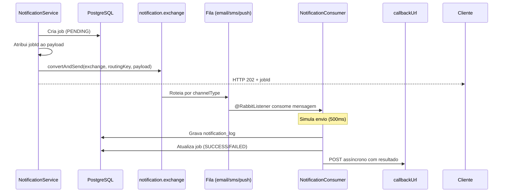

# RabbitMQ — Notification Center

Documentação da mensajaria assíncrona do **Unilabs Notification Center**.

---

## Visão Geral

O backend publica cada pedido de notificação num **Direct Exchange** do RabbitMQ. O campo `channelType` do payload determina a routing key e, consequentemente, a fila onde a mensagem será consumida.

```
Cliente HTTP ──► API REST ──► notification.exchange ──► fila por canal ──► Consumer ──► PostgreSQL + Callback
```

---

## Infraestrutura Local (Docker)

```bash
docker compose up -d
```

| Serviço    | Porta | Credenciais   |
|------------|-------|---------------|
| AMQP       | 5672  | guest / guest |
| Management | 15672 | guest / guest |

**Management UI:** [http://localhost:15672](http://localhost:15672)

Na interface web é possível monitorizar filas, taxas de consumo, mensagens em espera e bindings do exchange.

---

## Topologia

| Recurso      | Nome                         | Tipo    |
|--------------|------------------------------|---------|
| Exchange     | `notification.exchange`        | Direct  |
| Fila E-mail  | `notification.queue.email`     | Durable |
| Fila SMS     | `notification.queue.sms`       | Durable |
| Fila Push    | `notification.queue.push`      | Durable |

### Bindings

| Routing Key                  | Fila                         | Consumer                    | Provider simulado |
|-----------------------------|------------------------------|-----------------------------|-------------------|
| `notification.routing.email`| `notification.queue.email`   | `consumeEmailNotification`  | SendGrid          |
| `notification.routing.sms`  | `notification.queue.sms`     | `consumeSmsNotification`    | Twilio            |
| `notification.routing.push` | `notification.queue.push`    | `consumePushNotification`   | Firebase          |

Configuração em: `backend/src/main/java/com/unilabs/config/RabbitMQConfig.java`

---

## Formato da Mensagem (JSON)

A mensagem publicada no RabbitMQ é o mesmo objeto `NotificationRequest` serializado em JSON. O campo `jobId` é **atribuído pela API** antes da publicação — não deve ser enviado pelo cliente HTTP.

### Campos

| Campo          | Tipo     | Obrigatório | Descrição |
|----------------|----------|-------------|-----------|
| `jobId`        | UUID     | Sim*        | Gerado pelo servidor antes do publish |
| `clientId`     | string   | Sim         | Sistema de origem |
| `channelType`  | enum     | Sim         | `EMAIL`, `SMS` ou `PUSH` (`PUSH_NOTIFICATION` aceite como alias) |
| `recipient`    | string   | Sim         | E-mail, telefone (E.164) ou token FCM |
| `templateName` | string   | Não         | Nome do template |
| `parameters`   | object   | Não         | Parâmetros dinâmicos do template |
| `callbackUrl`  | string   | Sim         | URL para webhook de retorno |

\* Obrigatório na mensagem da fila; opcional no pedido HTTP inicial.

### Exemplo — E-mail

```json
{
  "jobId": "f784e1b8-6a31-4cfa-81a1-cf4939ff7b2b",
  "clientId": "portal-do-paciente",
  "channelType": "EMAIL",
  "recipient": "paciente@exemplo.com",
  "templateName": "template_resultados_exame",
  "parameters": {
    "nome_paciente": "Maria Silva",
    "data_exame": "2026-06-16"
  },
  "callbackUrl": "https://meu-sistema.com/webhooks/notificacoes"
}
```

**Routing key:** `notification.routing.email`  
**Fila:** `notification.queue.email`

### Exemplo — SMS

```json
{
  "jobId": "a12b34c5-d6e7-4890-abcd-ef1234567890",
  "clientId": "portal-do-paciente",
  "channelType": "SMS",
  "recipient": "+351912345678",
  "templateName": "template_lembrete_consulta",
  "parameters": {
    "data_consulta": "2026-06-20",
    "hora_consulta": "10:30"
  },
  "callbackUrl": "https://meu-sistema.com/webhooks/notificacoes"
}
```

**Routing key:** `notification.routing.sms`  
**Fila:** `notification.queue.sms`

### Exemplo — Push

```json
{
  "jobId": "b23c45d6-e7f8-4901-bcde-f12345678901",
  "clientId": "app-mobile",
  "channelType": "PUSH",
  "recipient": "fcm-token-exemplo-abc123",
  "templateName": "template_resultado_disponivel",
  "parameters": {
    "titulo": "Resultado disponível",
    "corpo": "O seu exame já pode ser consultado."
  },
  "callbackUrl": "https://meu-sistema.com/webhooks/notificacoes"
}
```

**Routing key:** `notification.routing.push`  
**Fila:** `notification.queue.push`

---

## Ciclo de Vida da Mensagem



---

## Identificação do Canal

O `channelType` é o campo principal que identifica o tipo de notificação:

| Valor JSON   | Canal   | Formato do `recipient`     |
|--------------|---------|----------------------------|
| `EMAIL`      | E-mail  | Endereço de e-mail válido  |
| `SMS`        | SMS     | Número de telefone (E.164) |
| `PUSH`       | Push    | Token do dispositivo (FCM) |

> O valor legado `PUSH_NOTIFICATION` é aceite e normalizado para `PUSH`.

A routing key é derivada automaticamente pelo `NotificationService` — não é necessário publicar diretamente na fila correta se usar a API REST.

---

## Configuração da Aplicação

```properties
spring.rabbitmq.host=localhost
spring.rabbitmq.port=5672
spring.rabbitmq.username=guest
spring.rabbitmq.password=guest
```

Ficheiro: `backend/src/main/resources/application.properties`

---

## Serialização

- **Converter:** `Jackson2JsonMessageConverter`
- **Content-Type:** `application/json`
- O enum `ChannelType` serializa como string (`EMAIL`, `SMS`, `PUSH`)

---

## Comportamento dos Consumers

Cada fila tem um listener dedicado em `NotificationConsumer`:

1. Recebe o `NotificationRequest` deserializado
2. Simula o envio ao provider (delay de 500ms)
3. Persiste log em `notification_logs` (com `channel_type`, `recipient`, `payload`)
4. Atualiza o job para `SUCCESS` ou `FAILED`
5. Dispara callback HTTP para `callbackUrl`

---

## Publicação Manual (sem API REST)

Para testes ou integrações que publicam diretamente no broker:

1. Certifique-se de que o `jobId` existe em `notification_jobs` (ou crie o job via API)
2. Publique no exchange `notification.exchange` com a routing key correta
3. Use `application/json` como content-type

**Routing keys válidas:**
- `notification.routing.email`
- `notification.routing.sms`
- `notification.routing.push`

---

## Monitorização e Troubleshooting

| Sintoma | Verificação |
|---------|-------------|
| Mensagens acumuladas na fila | Management UI → Queues → verificar `Ready` e consumers ativos |
| Job fica em PENDING | Verificar se o backend está a correr e os listeners estão registados |
| Job FAILED imediato | Erro na publicação RMQ — verificar ligação ao broker (porta 5672) |
| Callback não recebido | Verificar `webhook_status` na tabela `notification_jobs` |

---

## Limitações Atuais

- Envio simulado via providers (SendGrid/Twilio/Firebase) — prontos para substituição por integração real
- DLQ configurada (`notification.queue.dlq`) para mensagens rejeitadas pelo broker
- Reenvio manual de jobs falhados via `POST /api/v1/notifications/{jobId}/retry` (máx. 3 reenvios)

---

## Templates

Os templates são persistidos em `notification_templates` e pré-carregados no arranque. Placeholders usam formato `{{nome_parametro}}`.

| Template | Canal | Uso |
|----------|-------|-----|
| `template_resultados_exame` | EMAIL | Resultados de exames |
| `template_lembrete_consulta` | SMS | Lembretes de consulta |
| `template_resultado_disponivel` | PUSH | Notificações mobile |

Listar templates: `GET /api/v1/templates?channelType=SMS`

---

## Referências

- [README principal](../README.md) — API REST, Swagger e setup local
- [Swagger UI](http://localhost:8080/swagger-ui.html) — documentação interativa da API
- [OpenAPI JSON](http://localhost:8080/v3/api-docs) — especificação OpenAPI 3
